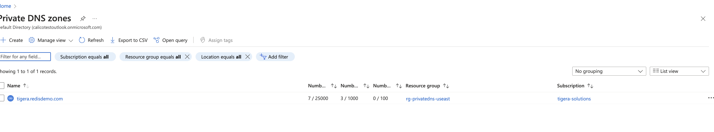
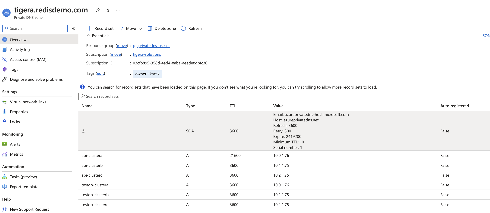
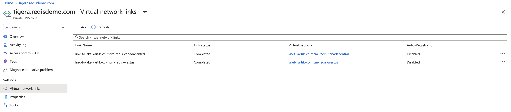
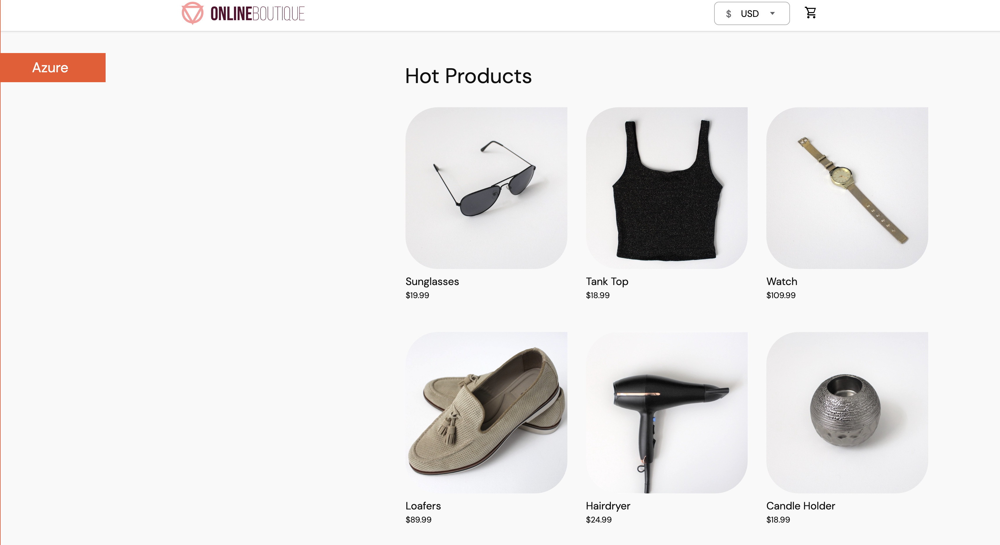
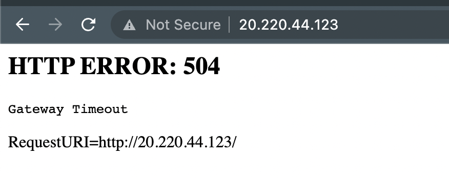
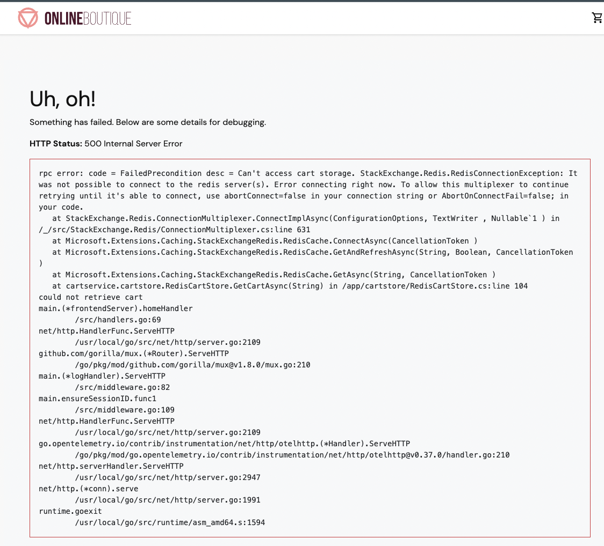

# cc-aks-redis-mcm-federation

> :warning: **This repo is purely a work-in-progress(WIP) and is in active development. Other than contributors, anyone else
>should probably not try the stuff in this repo and expect it to work as is until it's finished and ready!**

## Bringup Sequence

### Create Azure Resources

- Copy the example env variables file ```cp aks-prov/setup.env.example aks-prov/setup.env```  
- Setup your variables in ```aks-prov/setup.env```
- Run the bringup script ```bash aks-prov/create.sh```

```bash
bash aks-prov/create.sh
```

### Connect to CC

We know how to do this

### Deploy HAProxy-Ingress

- Copy the example env variables file ```cp haproxy-ingress/setup.env.example haproxy-ingress/setup.env```
- Setup the variables in your ```haproxy-ingress/setup.env```
- Run the bringup script ```bash haproxy-ingress/install-haproxy.sh```

```bash
bash haproxy-ingress/install.sh
```

Check the internal Azure AKS LB assigned the svc an EXTERNAL-IP off the Vnet subnet

```bash
kubectl get svc -n ingress-controller
```

### Deploy Redis on each cluster

The install bash script assumes you have the context names for each kubeconfig file and they're setup to be unique (AKS does this already and merges them properly)

- Copy the example env variables file ```cp redis/setup.env.example redis/setup.env```
- Setup the variables in your ```redis/setup.env```
- Run the script at ```redis/install-rec.sh```
  

```bash
bash redis/install-rec.sh
```

- The State should be running and Spec Status Valid (will take a while to deploy the StatefulSets)
- Check this on all clusters

```bash
~/w/azure-aks-mcm-federation main wip !53 ?5 ❯ kubectl get rec                                                       
NAME            NODES   VERSION     STATE     SPEC STATUS   LICENSE STATE   SHARDS LIMIT   LICENSE EXPIRATION DATE   AGE
demo-clusterb   3       6.2.18-65   Running   Valid         Valid           4              2023-03-19T20:36:00Z      3h32m
```


- Install the REC admission controller by running the script on each cluster
  (New script that takes care of this on all cluster contexts WIP)

```bash
bash redis/webhook/install-ac.sh
```

- Test the admisson controller on each cluster by trying to create an invalid spec

```bash
bash redis/webhook/test-ac.sh
```

You should get a result that says something like this

```
Error from server: error when creating "STDIN": admission webhook "redb.admission.redislabs" denied the request: 'illegal' is an invalid value for 'eviction_policy'
```


>**Reference**: https://docs.redis.com/latest/kubernetes/deployment/quick-start/


### Creating the active-active Redis db

>**Reference**: https://docs.redis.com/latest/kubernetes/re-clusters/create-aa-database/

#### Setting up Azure Private DNS Zone and records

- First you need to setup your DNS aliases in Azure Private DNS for each cluster 
- There is already an RG and zone setup for this in Azure, feel free to create the DNS A records in there and use the same zone if you want. 
- Wildcards can be used but I messed up so I created A entries for each name (oops)





- The other thing to ensure is that you have added the required Vnets of all the clusters the DNS zone to the virtual network links page so that the cluster vnets can actually resolve your DNS names in the zone.




#### Getting the active-active config parameters ready

- Open up the file redis/activeconfig.txt in your text editor
- Get all the values for all 3 clusters using the reference link as an example
- Get the crdb command ready with all values (as shown at the end of activeconfig.txt)
- Bash into one of the rec pods on any one cluster and run the crdb command

```bash
~/workspace/azure-aks-mcm-federation/redis main wip !16 ?5 ❯ kubectl exec -it demo-clustera-0 -- /bin/bash                                                                   ⎈ aks-kartik-cc-mcm-workshop-eastus/redis 15:52:10
Defaulted container "redis-enterprise-node" out of: redis-enterprise-node, bootstrapper
redislabs@demo-clustera-0:/opt$ crdb-cli crdb create \
>   --name testdb \
>   --memory-size 500MB \
>   --encryption yes \
>   --instance fqdn=demo-clustera.redis.svc.cluster.local,url=https://api-clustera.tigera.redisdemo.com,username=demo@redislabs.com,password=xia3cG8b,replication_endpoint=testdb-clustera.tigera.redisdemo.com:443,replication_tls_sni=testdb-clustera.tigera.redisdemo.com \
>   --instance fqdn=demo-clusterb.redis.svc.cluster.local,url=https://api-clusterb.tigera.redisdemo.com,username=demo@redislabs.com,password=IHqnWuvi,replication_endpoint=testdb-clusterb.tigera.redisdemo.com:443,replication_tls_sni=testdb-clusterb.tigera.redisdemo.com \
>   --instance fqdn=demo-clusterc.redis.svc.cluster.local,url=https://api-clusterc.tigera.redisdemo.com,username=demo@redislabs.com,password=9q44NKmF,replication_endpoint=testdb-clusterc.tigera.redisdemo.com:443,replication_tls_sni=testdb-clusterc.tigera.redisdemo.com
Task c28d64db-c652-4530-afa0-d539d001f28f created
  ---> CRDB GUID Assigned: crdb:b787a586-c212-4de5-93cd-aff32190a972
  ---> Status changed: queued -> started
  ---> Status changed: started -> finished
```

- If it all went well then status should go from started -> finished
- Check that ingress rule got created for your db (testdb in this example)

```bash
~/workspace/azure-aks-mcm-federation/redis main wip !16 ?5 ❯ kubectl get ingress                                                               28s ⎈ aks-kartik-cc-mcm-workshop-eastus/redis 15:52:39
NAME            CLASS    HOSTS                                  ADDRESS     PORTS   AGE
demo-clustera   <none>   api-clustera.tigera.redisdemo.com      10.0.1.76   80      2d5h
testdb          <none>   testdb-clustera.tigera.redisdemo.com   10.0.1.76   80      23s
```


### Testing that replication works

- Change context to your first cluster and bash into one of the db pods 

```bash
kubectl exec -it -n redis demo-clustera-0 -- /bin/bash
```

- Connect to db ClusterIP service for your cluster 

```bash
root@demo-clustera-0:/data# redis-cli -h testdb -p 19138
testdb:19138>
testdb:19138> set Name "Kartik"
OK
testdb:19138> set State "Something"
OK
```

- Change context to your second cluster and bash into one of the db pods
- When you get the Keys you created, you should see the values got replicated to this cluster's db 

```bash
root@demo-clusterb-0:/data# redis-cli -h testdb -p 19138
testdb:19138> get Name
"Kartik"
testdb:19138> get State
"Something"
```

### Redis service and database recovery

- When you stop and start an AKS cluster or as you go through the rest of the steps, there are two things that need to be done whenever the Redis pods are ALL taken down in a cluster and brought back up
  1. The Redis API service and pods need to be recovered as there is total loss of quorum (all 3 pods went down when the cluster was stopped)
  2. Any database (testdb in our case) also needs to be recovered.

- Both of these steps are to be done in sequence in one of the redis pods: 
  1. First run the cluster recovery command for your REC

     ```bash
     kubectl -n redis patch rec demo-clustera --type merge --patch '{"spec":{"clusterRecovery":true}}'
     ```

      Wait for all the pods in the StatefulSet to come back up fully
      All 3 pods should show ```2/2``` running containers

      ```bash
      NAME                                          READY   STATUS    RESTARTS       AGE
      demo-clusterb-0                               2/2     Running   0              120m
      demo-clusterb-1                               2/2     Running   0              119m
      demo-clusterb-2                               2/2     Running   0              116m
      ```

  2. Open a shell to one of the redis pods in your cluster (in this example clustera):

      ```bash
      kubectl exec -it demo-clustera-0 -n redis -- /bin/bash
      ```

      Check that the database is in a recoverable state

      ```bash
      rladmin status databases
      ```

      The output should show in ```STATUS``` as ```recovery (ready)```

      ```bash
      redislabs@demo-clustera-0:/opt$ rladmin status databases
      DATABASES:
      DB:ID         NAME       TYPE     STATUS                     SHARDS     PLACEMENT       REPLICATION        PERSISTENCE        ENDPOINT
      db:2          testdb     redis    recovery (ready)           1          dense           enabled            disabled           redis-11069.demo-clustera.redis.svc.cluster.local:11069
      ```

      Now run the command to recover the database

      ```bash
      rladmin recover all
      ```

      The database recovery should complete 100% fully

      ```bash
        0% [ 0 recovered | 0 failed ] |                                    | Elapsed Time: 0:00:00[testdb (db:2) recovery] Initiated.
        50% [ 0 recovered | 0 failed ] |################################   | Elapsed Time: 0:00:00[testdb (db:2) recovery] Completed successfully
        100% [ 1 recovered | 0 failed ] |##################################| Elapsed Time: 0:00:02
      ```

      Check the status of database, ```STATUS``` should show ```active```

      ```bash
      DATABASES:
      DB:ID          NAME        TYPE      STATUS      SHARDS      PLACEMENT        REPLICATION         PERSISTENCE         ENDPOINT
      db:2           testdb      redis     active      1           dense            enabled             disabled            redis-11069.demo-clustera.redis.svc.cluster.local:11069
      ```

### Federation Setup

>**Reference**: https://docs.tigera.io/calico-cloud/multicluster/kubeconfig

- Copy the example env variables file ```cp federation-setup/setup.env.example federation-setup/setup.env```
- Setup the variables in your ```federation-setup/setup.env```
- Run the bringup script ```bash federation-setup/install-federation.sh```

#### Verifying that federated endpoints got created  

##### Linux Users

- If your laptop/machine is Linux-based or you are running a Linux VM that is setup with access to your K8s clusters, then just download calicoq CLI tool from the [Calico docs](https://docs.tigera.io/calico-enterprise/3.15/operations/clis/calicoq/installing#install-calicoq-as-a-binary-on-a-single-host)
- Run the following command against your clusters 

```bash
calicoq eval "all()"
```

  You should get something like this where you see remote endpoints prefixed by the RemoteClusterConfig name you created in the earlier steps as well as local endpoints with the format host-a/endpoint:

  ```bash
  (Lots of remote endpoints)
  Workload endpoint calico-demo-remote-canadacentral/aks-nodepool1-86764462-vmss000000/k8s/redis.demo-clusterb-services-rigger-d45c6c4-cp4g8/eth0
  Workload endpoint calico-demo-remote-canadacentral/aks-nodepool1-86764462-vmss000000/k8s/redis.demo-clusterb-1/eth0
  Workload endpoint calico-demo-remote-canadacentral/aks-nodepool1-86764462-vmss000001/k8s/redis.demo-clusterb-0/eth0
  Workload endpoint calico-demo-remote-canadacentral/aks-nodepool1-86764462-vmss000002/k8s/redis.demo-clusterb-2/eth0
  ```

##### MacOS/Windows Users

- If your laptop/machine is Darwin/MacOS or you use WSL, then we have to do things the hard way (REALLY annoying and bad security practice) by using a privileged debug pod on one of the cluster nodes to temporaily install calicoq and do our verification there because calicoq does not have a MacOS/Darwin binary yet. Just spin up a Linux VM anyway is the recommended method but read further if you really want to do this on Mac/Windows.

- Switch to your cluster context
- Get the nodename of one of the worker nodes and save it in a variable

```bash
NODE_NAME=$(kubectl get nodes -o jsonpath='{.items[*].status.addresses[?(@.type=="Hostname")].address}'| awk '{print $1;}')
```

- Spin up a debug privileged pod

```bash
kubectl debug node/$NODE_NAME -it --image=mcr.microsoft.com/aks/fundamental/base-ubuntu:v0.0.11
```

- In the pod, get to host namespace as root

```bash
chroot /host
```

- Grab the calicoq binary and install it

```bash
cd /usr/local/bin
curl -o calicoq -O -L https://downloads.tigera.io/ee/binaries/v3.15.1/calicoq
chmod +x calicoq
```

- Create the config file for it 

```bash
vi /etc/calico/calicoctl.cfg
```

Paste in the following: 

```yaml
apiVersion: projectcalico.org/v3
kind: CalicoAPIConfig
metadata:
spec:
  datastoreType: "kubernetes"
  kubeconfig: "/.kube/config"
```

- Create the /.kube/config file, put your config file into it

```bash
mkdir /.kube
vi /.kube/config
```

Paste your kubeconfig for the cluster from your laptop's ~/.kube/config (or wherever you have it), save the file.

- Now run calicoq

```bash
calicoq eval "all()"
```

  You should get something like this where you see remote endpoints prefixed by the RemoteClusterConfig name you created in the earlier steps as well as local endpoints with the format host-a/endpoint:

  ```bash
  (Lots of remote endpoints)
  Workload endpoint calico-demo-remote-canadacentral/aks-nodepool1-86764462-vmss000000/k8s/redis.demo-clusterb-services-rigger-d45c6c4-cp4g8/eth0
  Workload endpoint calico-demo-remote-canadacentral/aks-nodepool1-86764462-vmss000000/k8s/redis.demo-clusterb-1/eth0
  Workload endpoint calico-demo-remote-canadacentral/aks-nodepool1-86764462-vmss000001/k8s/redis.demo-clusterb-0/eth0
  Workload endpoint calico-demo-remote-canadacentral/aks-nodepool1-86764462-vmss000002/k8s/redis.demo-clusterb-2/eth0
  ```

- Yup, that was real easy on a non-Linux laptop /s

> :warning: **SUPER IMPORTANT**: Delete your privileged debug pod once the actual debugging is done!


### Deploy the Demo Microservices App

Let's install the hipstershop microservices app from this repo into all of our clusters. 

- Copy the example env variables file ```cp app/setup.env.example app/setup.env```
- Setup the variables in your ```app/setup.env```
- Run the bringup script ```bash app/install-app.sh```


Now let's check that the ```frontend-external``` service got a public-IP we can use to access the app running on that cluster.

The service output might look like:

```bash
NAME                    TYPE           CLUSTER-IP    EXTERNAL-IP   PORT(S)        AGE
frontend-external       LoadBalancer   10.0.25.5     45.26.20.15   80:31077/TCP   6h11m
```

Bring up a broswer and access/use the app



Setup a ```redis-cli``` client pod for later debugging with the redis db pods, do this in all clusters

```bash
kubectl run redis-cli3 -n redis --image redis:latest --leave-stdin-open
```

Connect to the testdb database on both your clusters and check that the db is getting populated

```bash
kubectl -n redis exec -it redis-cli3 -- /bin/bash
```

Connect to the local db service

```bash
redis-cli -h testdb -p 11069
```

Get all keys 

```bash
keys *
```

You should get something like:

```
testdb:11069> keys *
  1) "04e26cbe-7b69-40d8-90ea-88ae684456f1"
  2) "e4dbcfa8-5b08-4476-af69-8249b8f71792"
  3) "2ba02043-d00f-4850-b5fc-429d77e9a70d"
  4) "7255eb5b-07ab-4aba-bb77-2a0e094e4f33"
  5) "709aaa33-fab0-462d-9f6a-1f057ae8410a"
  6) "9f8593aa-f83a-4250-aaa1-ca69deaa08cd"
  7) "ca0eab31-519a-4358-bdb5-8ca9d213c4da"
  8) "8ce16017-494d-4894-9d87-3fcb197751d6"
  9) "303478b1-e1b9-43d0-a1d3-5533d5293a66"
 1)  "67a96e15-61bc-49c2-b885-168eb8aa6162"
```

"Insert blurb about the Redis architecture somewhere"

Redis Active-Active db architecture: 

- Basically in one cluster there are 3 Redis pods in active-backup where at any point one pod is active/master and other two are storing shards. 
- The 3 pods maintain a quorum and can survive upto 2 pods dying and the shards moving between the 3 pods but in terms of services or endpoints there will always only be one pod that is active for the database 
- As per the example below, ```demo-clustera-2```  is the active/master pod backing the testdb service:

```bash
kubectl get pods -n redis -o wide | grep demo-clustera                         
demo-clustera-0                                  2/2     Running   0          155m   10.0.0.107   aks-nodepool1-62893527-vmss000005   <none>           <none>
demo-clustera-1                                  2/2     Running   0          153m   10.0.1.69    aks-nodepool1-62893527-vmss000003   <none>           <none>
demo-clustera-2                                  2/2     Running   0          150m   10.0.0.116   aks-nodepool1-62893527-vmss000004   <none>           <none>
```

```bash
kubectl get svc -n redis | grep testdb                                   
testdb               ClusterIP   10.0.25.56    <none>        11069/TCP           2d11h
testdb-headless      ClusterIP   None          <none>        11069/TCP           2d11h
```

```bash
kubectl get endpoints testdb -n redis
NAME     ENDPOINTS          AGE
testdb   10.0.0.116:11069   2d11h
```

### Inducing a unique failure scenario

Let's break the db service by putting the Redis pods in 'recovery' mode. In this mode the pods all get recreated, but the database will be offline because there is no quorum (all 3 pods went down). 

While in one cluster, Redis+K8s can survive 2/3 pods dying - however, all 3 pods dying or the database getting degraded by losing quorum is a situation that can make the db in one cluster/region fail by complete loss of quorum. In this scenario, while the pod endpoint IP is still reachable but database service times out, there is still a snapshot of the db that can be used to repair it but human intervention is necessary.

We will utilize this failure scenario to take down the database and demo the power of Calico Cloud federated services with Redis in Active-Active replication across 2 (or more) clusters and how to survive this situation without much service loss.

Pick one cluster (or more) to take down the service and change to that context, just remember that atleast one cluster should have it's redis and testdb svc working properly: 

First let's put the Redis pods in 'recovery' state in the clusters you want to take down:

```bash
kubectl -n redis patch rec demo-clustera --type merge --patch '{"spec":{"clusterRecovery":true}}'
```

The STATE for the CRD rec should go into ```Recoveringxxx``` mode and you should see the pods recreating one by one as per the StatefulSet

```bash
kubectl get rec -n redis
NAME            NODES   VERSION     STATE                SPEC STATUS   LICENSE STATE   SHARDS LIMIT   LICENSE EXPIRATION DATE   AGE
demo-clustera   3       6.2.18-65   RecoveringFirstPod   Valid                                                                  2d12h
```

```bash
kubectl get pods -n redis
NAME                                             READY   STATUS    RESTARTS   AGE
demo-clustera-0                                  2/2     Running   0          2m19s
demo-clustera-1                                  1/2     Running   0          57s
```

Now while this is going on, refresh your browser page and it should timeout with Error 500 that the Redis service is not reachable or an Error 504 Gateway Not Available





We want to now use a federated service for testdb to ensure HA and bring up the svc again.

### Setup a federated service for testdb

First we need to label the testdb service in all our clusters so that the Tigera controller can federate them. Do this in each of your clusters:

```bash
kubectl label svc -n redis testdb federation=yes
```

Now apply the federated svc yaml

```bash
kubectl apply -f federation-setup/testdb-federated.yaml
```

Now you want to check that the endpoints in out new federated testdb svc has the remote cluster endpoints

On each cluster, do this

```bash
kubectl get endpoints -n redis testdb-federated -oyaml
```

You should see something like this:

```yaml
apiVersion: v1
kind: Endpoints
metadata:
  annotations:
    federation.tigera.io/serviceSelector: federation == "yes"
  creationTimestamp: "2023-03-02T00:26:17Z"
  name: testdb-federated
  namespace: redis
  resourceVersion: "1240287"
  uid: d4e1ec9e-519d-415f-9f1e-2598698d1f42
subsets:
- addresses:
  - ip: 10.0.0.166
    nodeName: aks-nodepool1-62893527-vmss000004
    targetRef:
      kind: Pod
      name: demo-clustera-2
      namespace: redis
      resourceVersion: "1240277"
      uid: c5e7139e-f3a2-45f8-9296-e43d7ad78ffd
  ports:
  - name: redis
    port: 11069
    protocol: TCP
- addresses:
  - ip: 10.1.1.3
    nodeName: aks-nodepool1-86764462-vmss000005
    targetRef:
      kind: Pod
      name: calico-demo-remote-canadacentral/demo-clusterb-1
      namespace: redis
      resourceVersion: "908315"
      uid: e7d5f978-4031-4d2b-afaa-d4721023001f
  ports:
  - name: redis
    port: 11069
    protocol: TCP
```
Note the nodeName fields as well as ```. targetRef.name``` field referencing the remote cluster. Also compare the pod names and IP addresses which will give the full picture.

We're not done yet, our hipstershop is still broken because we purposely haven't pointed to the federated svc that we called ```testdb-federated```

Check the service:

```bash
kubectl get svc -n redis | grep testdb                    
testdb               ClusterIP   10.0.25.56    <none>        11069/TCP           2d12h
testdb-federated     ClusterIP   10.0.27.165   <none>        11069/TCP           8h
testdb-headless      ClusterIP   None          <none>        11069/TCP           2d12h
```

Now let's edit the deployment for the cartservice to point to the federated svc

```bash
kubectl edit deploy cartservice -n hipstershop
```

Look for the line REDIS_ADDR and change the value to ```testdb-federated.redis``` :

```bash
- name: REDIS_ADDR
  value: testdb-federated.redis:11069
```

>**Note:** "There's a better way to do this with kubectl patch than editing the deployment but I'm too lazy to do it now. We fix this in post - KB"

You'll see the cartservice pod get recreated and once it's up refresh your browser page and the app should reload because now it's essentially talking to the replicated db in your working cluster/s. Yay.

## Teardown

- Reverse all the config for federation (if done)

```bash
bash federation-setup/teardown-federation.sh
```

- Run the teardown script to delete all the Azure resources

```bash
bash aks-prov/destroy.sh
```


## Changelog/Need to do

### Mar 07, 2023

- Finish README and scripts content (TO-DO)
- Tighten up the demo flow (TO-DO)
- Document the gotchas about hipstershop cartservice and Redis svc consumption (TO-DO)
- Generate reference architecture and network diagrams (TO-DO)

### Mar 02, 2023

- Federated svc for Redis done and failure scenario tested, README instructions updated. Needs to be tested. (DONE)
- Need to deploy app in 2nd cluster,  set up DNS round robin for frontend service with sticky sessions (DONE)
- Break up the README into modules (WIP)
- Generally improve readability, add images, all that good stuff (WIP)

### Feb 28, 2023

- Heavy edits to federation setup and teardown scripts and flow in a new branch, needs to be tested (DONE)

### Feb 17, 2023

- Configure Hipstershop service to talk to redis and do its things, check that db is getting seeded (DONE)
- Policies (OUT OF SCOPE FOR NOW)
- Demo flow decisions (DONE)
